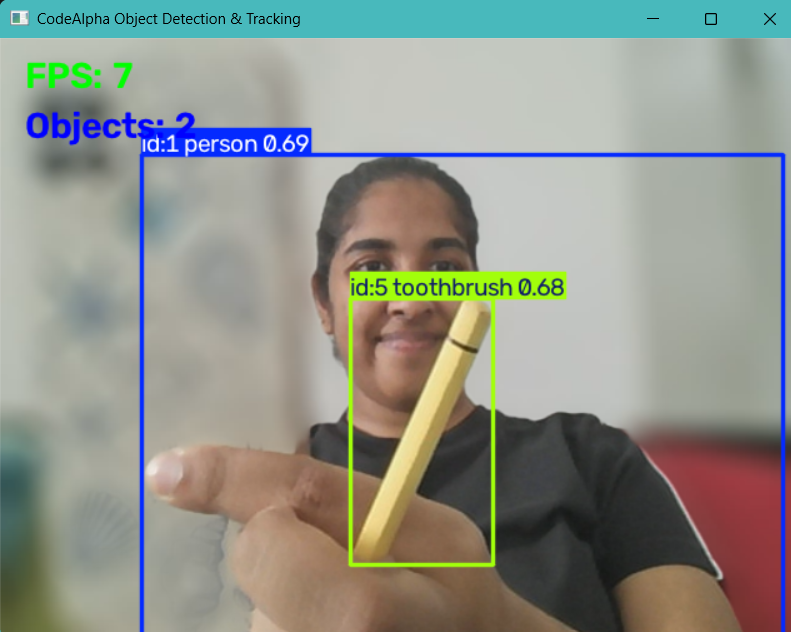

# 🚀 CodeAlpha Object Detection & Tracking


> A real-time object detection and tracking system built with **Python, OpenCV, and YOLOv8**.

---

## 📌 Project Overview

**CodeAlpha Object Detection & Tracking** is a real-time computer vision application developed as part of the **CodeAlpha Artificial Intelligence Internship**.

The system captures live video from a webcam and uses the **YOLOv8** object detection model to identify objects in each frame. It also performs real-time object tracking and assigns tracking IDs to detected objects.

The application provides useful real-time information such as:

- Detected objects
- Tracking IDs
- Bounding boxes
- Detection confidence
- Frames Per Second (FPS)
- Number of detected objects

The project demonstrates the practical application of **AI-based computer vision, object detection, and real-time tracking**.

---

## ✨ Key Features

### 🤖 Real-Time Object Detection

Uses the lightweight **YOLOv8 Nano** model to detect objects from a live webcam feed.

### 🎯 Object Tracking

Uses YOLO's tracking functionality with persistent tracking to maintain object identities across video frames.

### 📦 Bounding Boxes

Detected objects are displayed with bounding boxes and class labels.

### 🆔 Tracking IDs

Each tracked object receives a unique ID that remains associated with the object while it is being tracked.

### 📊 FPS Counter

Displays the approximate real-time processing speed of the application.

### 🔢 Object Counter

Displays the number of objects detected in the current frame.

### 📸 Screenshot Capture



### ⌨️ Keyboard Controls

| Key | Action |
|-----|--------|
| `S` | Save screenshot |
| `Q` | Quit application |

---

## 🧠 How It Works

The application follows the pipeline below:

```text
Webcam
   │
   ▼
OpenCV Video Capture
   │
   ▼
YOLOv8 Object Detection
   │
   ▼
Object Tracking
   │
   ▼
Bounding Boxes + Tracking IDs
   │
   ├── FPS Counter
   │
   ├── Object Counter
   │
   └── Confidence Scores
   │
   ▼
Real-Time Display